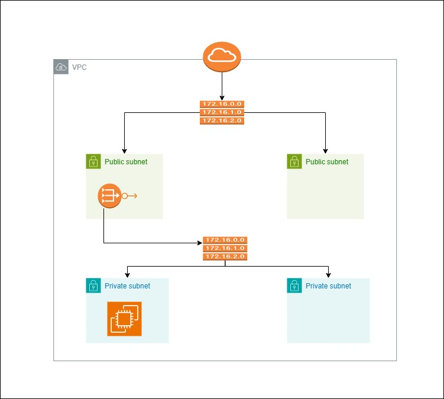

📌 **AWS Mega Project – Week 1 Task**

 **Goal**: Design & Deploy the Core VPC Architecture shown below.

🗂️ **Your Task**:

✅ Create a custom VPC  
✅ Add 2 Public Subnets across different AZs  
✅ Add 2 Private Subnets across different AZs  
✅ Attach an Internet Gateway  
✅ Launch a NAT Gateway in one public subnet  
✅ Setup route tables properly  
✅ Launch 1 EC2 in public and 1 in private subnet – test connectivity  

**Clues to Help You**:

🔍 **Clue 1**: CIDR block = `172.16.0.0/16`. Divide this into 4 subnets logically.

🔍 **Clue 2**: Private subnets can't access the internet directly.

🔍 **Clue 3**: Check your Route Tables – they define where traffic flows!

 **Refer to Architecture Diagram Below**  
