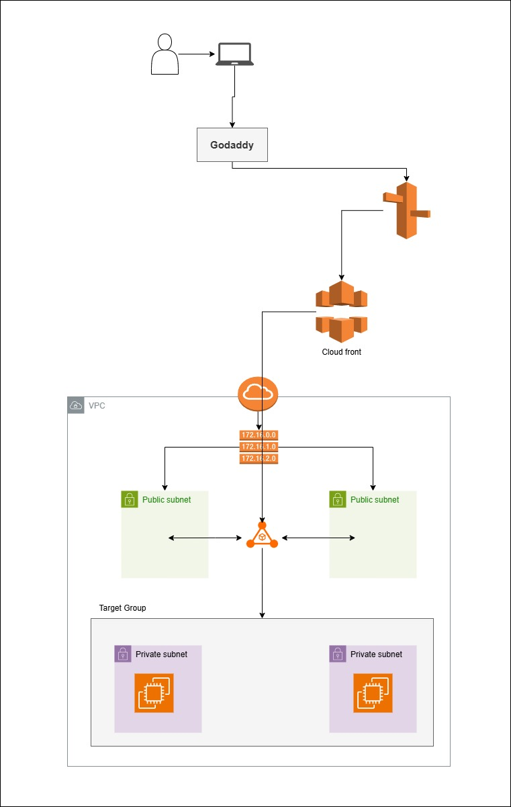

📌 **AWS Mega Project – Week 2 Task**

**Goal**: Connect your architecture to the outside world using GoDaddy, Route53, S3, and CloudFront — and launch web servers in a **3-tier** setup.

**Your Task**:

✅ Register a domain on **GoDaddy** (or use a free domain)  
✅ Configure **Route 53** to route traffic to your app  
✅ Set up **CloudFront** distribution pointing to your S3 bucket  
✅ Setup an **Application Load Balancer (ALB)** in public subnets  
✅ Register EC2 instances (private subnet) in **Target Group**  
✅ ALB should route user requests to EC2s in private subnet  
✅ Test: Domain ➜ Route53 ➜ CloudFront ➜ ALB ➜ EC2  

**Clues to Help You**:

🔍 **Clue 1**: CloudFront needs an origin to LB 
🔍 **Clue 2**: EC2 in private subnet can be accessed only via Load Balancer.  
🔍 **Clue 3**: Use `nslookup` to verify DNS resolution and test the full path.

**Architecture reference posted below**  
