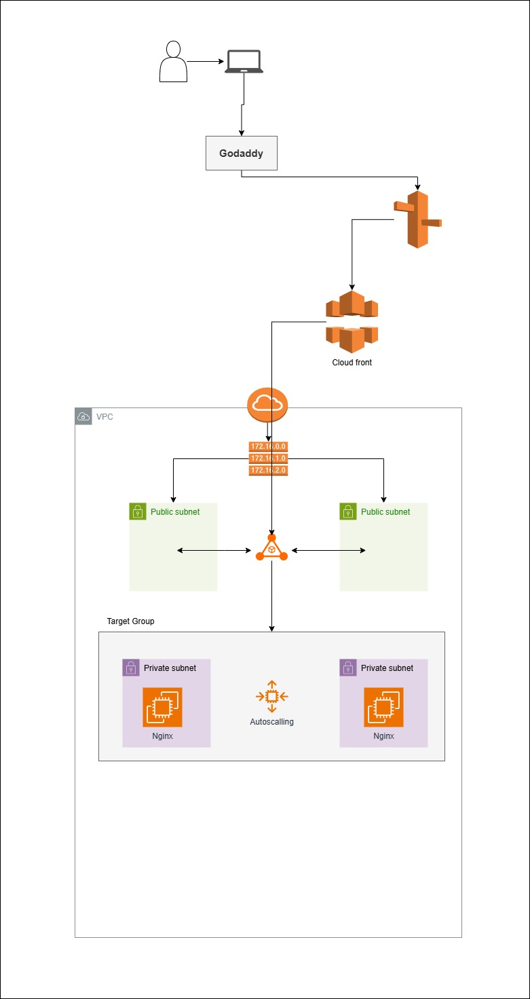

## Week 3: NGINX Proxy Layer Setup

✅ Objective: Deploy NGINX as a reverse proxy in private subnets

Tasks:

Launch EC2 instances (NGINX) in private subnets

Allow ALB (Week 2) to send traffic to NGINX (via Target Group)

Add autoscalling for Nginx (based on number of request)

Test end-to-end: GoDaddy → Route53 → CloudFront → ALB → NGINX

🔧 Tools:

EC2, Security Groups, NGINX, ALB Target Groups

---

## Architecture
