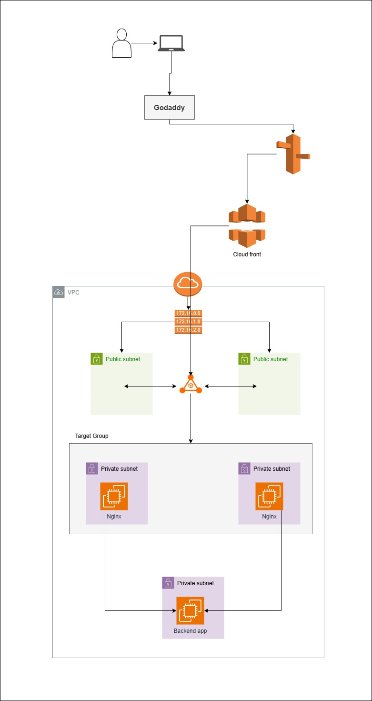

📦 **AWS Mega Project – Week 3 Task**

📊 **Architecture Layers**:
1️⃣ **Presentation Layer**: Nginx EC2s (private subnet)  
2️⃣ **Application Layer**: Backend app (private subnet)  
3️⃣ **Networking Layer**: Load Balancer in public subnet

🛠️ **Key Components**:

✅ **Public Subnets** for ALB  
✅ **Private Subnets** for Nginx and Backend  
✅ **Target Group** to forward traffic from ALB to Nginx  
✅ Nginx ➜ proxies request to Backend EC2 app

🔐 **Security Best Practices**:
- Backend EC2: No public IP  
- Nginx EC2: Only accessible via ALB  
- ALB: Placed in public subnet, exposed to internet

📌 **Bonus Add-on**:
- Configure **health checks**  
- You can use same application or Docker image for backen

