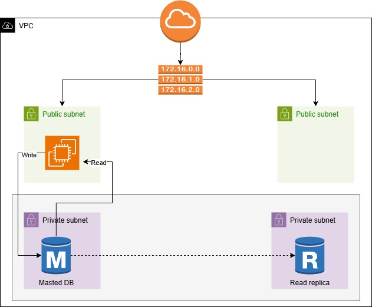

## 📚 Week 5: Database Layer + Synchronization

✅ Objective: Setup master-replica DB and connect app for read/write split

Tasks:

Launch RDS (or EC2 DB) for:

Master (write) DB

Replica (read-only) DB

Configure synchronization (automatic in RDS, manual for EC2)

Modify application to:

Write to master

Read from replica

Final test: Full flow working with domain, proxy, app, and DB

🔧 Tools:

RDS (MySQL/PostgreSQL), EC2-based DB (optional), App Config

---

###

