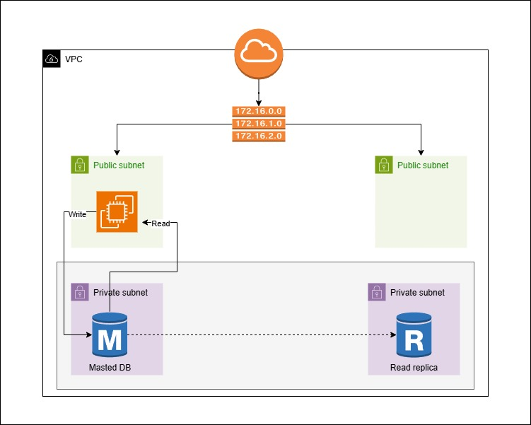

Week 5 - AWS 3-Tier Architecture Project

🔧 What’s done:

✅ Master DB (write) in a private subnet  
✅ Read Replica (read) in a separate private subnet  
✅ Web Server in public subnet configured to:
   ➡️ Write to Master  
   ⬅️ Read from Replica

🔐 Security:
- DB servers placed in **private subnets** for isolation  
- No public IPs assigned to DB instances  
- Access restricted via security groups

📍 VPC CIDR: `172.16.0.0/16`  
📍 Subnets: Public & Private (across multiple AZs)

🎯 Purpose: Improve **performance**, maintain **security**, and prepare for **scalability**

